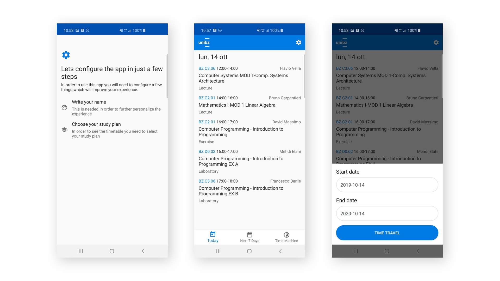

# UnibzTimetable

## Introduction
This project is an Android application that I am building in order to facilitate the access to the university
timetable of the Free University of Bolzano.
## Goal
The main goal of this project is to experiment with advanced architectural patterns in order to create
a scalable, mantainable and highly readable codebase.
## More to come
The application is currently in a development phase, thus new things will
be added in future.
I am planning of building an article explaining all the choices behind this
architecture and my thoughts of it.